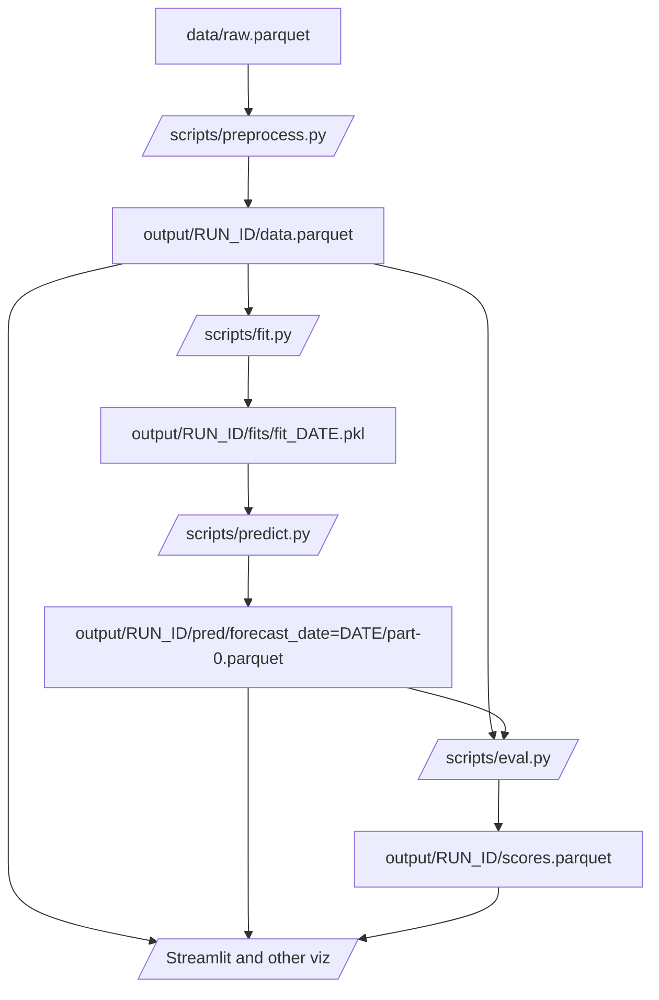

# Vaccination coverage forecasting

_Formerly known as Immunization Uptake Projections, or `iup`._

This repo represents an experimental prototype for forecasting the coverage of vaccinations.

## Getting started

1. Read the docs at <https://cdcgov.github.io/cfa-immunization-uptake-projection>, or build them locally with `mkdocs serve`
1. This project uses [`uv`](https://docs.astral.sh/uv/) for environment and dependency management. Ensure you can `uv sync`. Use the uv-managed virtual environment (e.g., by prepending `uv run`).
1. Run the [vignette](#vignette).

## Vignette

The vignette demonstrates a workflow using this package:

1. Fit a model to coverage data from past seasons
1. Use it to forecast future coverage data in the latest season
1. Evaluate forecasts against observed values

### Data source

For convenience, the raw data are tracked in this repo under `data/`, which includes the script `get_nis.py`, used to collect that data with [`nis-py-api`](https://github.com/CDCgov/nis-py-api). These are estimates of season flu vaccination coverage, tracked monthly from the 2009/2010 to 2022/2023 seasons, from the [National Immunization Survey](https://www.cdc.gov/nis/about/index.html).

### Running the vignette

1. Set up the config:
   - Copy `scripts/config_template.yaml` to `scripts/config.yaml` or
   - in the next step, specify `CONFIG=you_path` when calling `make`.
2. Run the pipeline with `make`. (You can run steps in parallel with, e.g., `make -j4`.)
3. Inspect `output/vignette/`:
   - `config.yaml`: a copy of the input config
   - `data.parquet`: the preprocessed, observed data
   - `fits/`: pickled model fits, organized by forecast date
   - `pred/`: model predictions, in Hive-partitioned parquet files
   - `scores.parquet`: model scores
4. Run `make viz` for interactive visualization of those results.

You can modify `config.yaml` or point to a new config file to produce different results.

### Vignette workflow

## Project admins

- Scott Olesen (CDC/CFA/Predict) <ulp7@cdc.gov>

## Disclaimers

### General Disclaimer

This repository was created for use by CDC programs to collaborate on public health related projects in support of the [CDC mission](https://www.cdc.gov/about/organization/mission.htm). GitHub is not hosted by the CDC, but is a third party website used by CDC and its partners to share information and collaborate on software. CDC use of GitHub does not imply an endorsement of any one particular service, product, or enterprise.

### Public Domain Standard Notice

This repository constitutes a work of the United States Government and is not subject to domestic copyright protection under 17 USC § 105. This repository is in the public domain within the United States, and copyright and related rights in the work worldwide are waived through the [CC0 1.0 Universal public domain dedication](https://creativecommons.org/publicdomain/zero/1.0/). All contributions to this repository will be released under the CC0 dedication. By submitting a pull request you are agreeing to comply with this waiver of copyright interest.

### License Standard Notice

This repository is licensed under ASL v2 or later.

This source code in this repository is free: you can redistribute it and/or modify it under the terms of the Apache Software License version 2, or (at your option) any later version.

This source code in this repository is distributed in the hope that it will be useful, but WITHOUT ANY WARRANTY; without even the implied warranty of MERCHANTABILITY or FITNESS FOR A PARTICULAR PURPOSE. See the Apache Software License for more details.

You should have received a copy of the Apache Software License along with this program. If not, see http://www.apache.org/licenses/LICENSE-2.0.html

The source code forked from other open source projects will inherit its license.

### Privacy Standard Notice

This repository contains only non-sensitive, publicly available data and information. All material and community participation is covered by the [Disclaimer](https://github.com/CDCgov/template/blob/master/DISCLAIMER.md) and [Code of Conduct](https://github.com/CDCgov/template/blob/master/code-of-conduct.md). For more information about CDC's privacy policy, please visit [http://www.cdc.gov/other/privacy.html](https://www.cdc.gov/other/privacy.html).

### Contributing Standard Notice

Anyone is encouraged to contribute to the repository by [forking](https://help.github.com/articles/fork-a-repo) and submitting a pull request. (If you are new to GitHub, you might start with a [basic tutorial](https://help.github.com/articles/set-up-git).) By contributing to this project, you grant a world-wide, royalty-free, perpetual, irrevocable, non-exclusive, transferable license to all users under the terms of the [Apache Software License v2](http://www.apache.org/licenses/LICENSE-2.0.html) or later.

All comments, messages, pull requests, and other submissions received through CDC including this GitHub page may be subject to applicable federal law, including but not limited to the Federal Records Act, and may be archived. Learn more at [http://www.cdc.gov/other/privacy.html](http://www.cdc.gov/other/privacy.html).

### Records Management Standard Notice

This repository is not a source of government records but is a copy to increase collaboration and collaborative potential. All government records will be published through the [CDC web site](http://www.cdc.gov).
