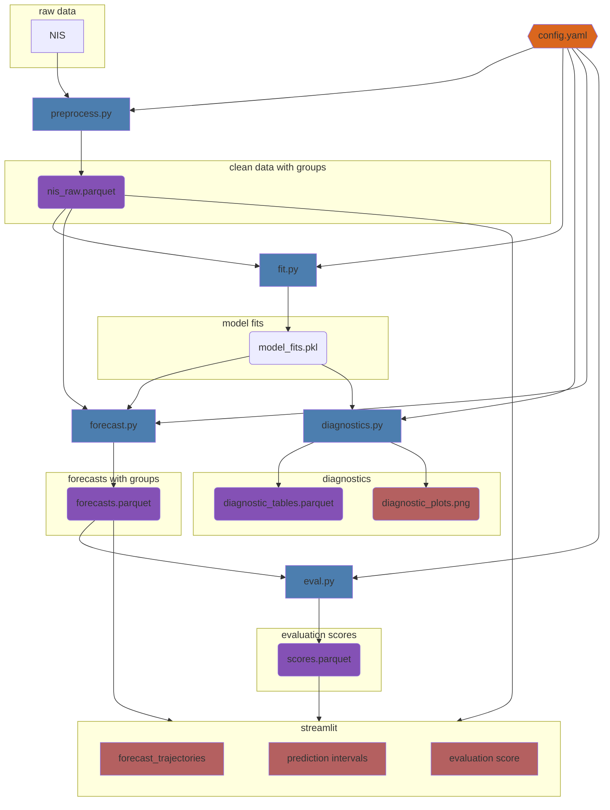

# Immunization uptake projections

This repo contains statistical tools to predict the uptake of immunizations (primarily vaccines and boosters). The three primary steps are:

1. Import data sets on past uptake and cast them into a standardize format
2. Fit a variety of models that both capture past uptake as well as project future uptake, and
3. Evaluate model projections against realized uptake.

All three steps are currently under development.

This approach is applicable to seasonal adult immunizations. Each year, the uptake process starts afresh, and individuals' transitions across age groups are not relevant.

## Data sources

Use <https://github.com/CDCgov/nis-py-api> for access to the NIS data.

## Getting started

1. Set up a virtual environment with `poetry shell`.
2. Installed the required dependencies with `poetry install`.
3. Get a [Socrata app token](https://github.com/CDCgov/nis-py-api?tab=readme-ov-file#getting-started) and save it in `scripts/socrata_app_token.txt`.
4. Cache NIS data with `make nis`.
5. Copy the config template in `scripts/config_template.yaml` to `scripts/config.yaml` and fill in the necessary fields.
    - data: specify the vaccination uptake data to use, including a de facto annual start of the disease season, filters for rows and columns to keep, and grouping factors by which to partition forecasts.
    - forecast_timeframe: specify the start and the end of the forecast period and the interval between reference dates in the forecast (using the [polars string language](https://docs.pola.rs/api/python/dev/reference/expressions/api/polars.date_range.html), e.g., `7d`).
    - evaluation_timeframe: specify the interval between forecast dates if multiple forecasts are desired (sharing the same end of the forecast period). This will create different forecast horizons, which can be compared with evaluation scores. If blank, no evaluation score will not be computed.
    - models: specify the name of the model (refer to `iup.models`), random seed, initial values of parameters, and parameters to use NUTS kernel in MCMC run.
    - scores: specify the quantile of the posterior forecasts to use for evaluation, the date(s) on which to compute absolute difference, and any additional evaluation metrics (e.g. mean squared prediction error as `mspe`).
    - forecast_plots: specify the credible interval (in fractional terms) and number of randomly chosen trajectories to show on forecast plots.
    - diagnostics: specify the model (refer to `iup.models`) and the range of forecast dates (i.e. a list of earliest and latest) on which to perform diagnostics, as well as the types of plots and tables to create (refer to `iup.diagnostics`).
6. Run `make all` to run the model fitting and forecasting pipeline. This will create six `output/` subfolders:
    - `settings`: a copy of the config.
    - `data`: the pre-processed data.
    - `fits`: the fit model object(s).
    - `diagnostics`: diagnostic plots and tables for the desired model(s) and forecast date(s).
    - `forecasts`: posterior predictions and forecasts.
    - `scores`: evaluation scores comparing model structures and/or forecast dates.
    Each run of the pipeline is assigned a `RUN_ID`. When a new `RUN_ID` is given, a new subfolder will be created inside each of the above six folders to store the corresponding outputs. When an existing `RUN_ID` is given, the contents of that `RUN_ID`'s existing subfolders will be overwritten, assuming the pipeline inputs have changed since the last run. `RUN_ID` can be assigned in line 1 of the Makefile or directly in the command line `make all RUN_ID=name_of_run`.
7. Run `make viz` to open a streamlit app in web browser, which shows the individual forecast trajectories, credible intervals, and evaluation scores, with options of dimensions and filters to customize the visualization.
8. Run `make clean` to remove all outputs for a particular `RUN_ID` and `make delete_nis` to delete the NIS data from the cache.

#### Package workflow:

## Project admins

- Edward Schrom (CDC/CFA/Predict) <tec0@cdc.gov>

## General Disclaimer

This repository was created for use by CDC programs to collaborate on public health related projects in support of the [CDC mission](https://www.cdc.gov/about/organization/mission.htm). GitHub is not hosted by the CDC, but is a third party website used by CDC and its partners to share information and collaborate on software. CDC use of GitHub does not imply an endorsement of any one particular service, product, or enterprise.

## Public Domain Standard Notice

This repository constitutes a work of the United States Government and is not
subject to domestic copyright protection under 17 USC § 105. This repository is in
the public domain within the United States, and copyright and related rights in
the work worldwide are waived through the [CC0 1.0 Universal public domain dedication](https://creativecommons.org/publicdomain/zero/1.0/).
All contributions to this repository will be released under the CC0 dedication. By
submitting a pull request you are agreeing to comply with this waiver of
copyright interest.

## License Standard Notice

This repository is licensed under ASL v2 or later.

This source code in this repository is free: you can redistribute it and/or modify it under
the terms of the Apache Software License version 2, or (at your option) any
later version.

This source code in this repository is distributed in the hope that it will be useful, but WITHOUT ANY
WARRANTY; without even the implied warranty of MERCHANTABILITY or FITNESS FOR A
PARTICULAR PURPOSE. See the Apache Software License for more details.

You should have received a copy of the Apache Software License along with this
program. If not, see http://www.apache.org/licenses/LICENSE-2.0.html

The source code forked from other open source projects will inherit its license.

## Privacy Standard Notice

This repository contains only non-sensitive, publicly available data and
information. All material and community participation is covered by the
[Disclaimer](https://github.com/CDCgov/template/blob/master/DISCLAIMER.md)
and [Code of Conduct](https://github.com/CDCgov/template/blob/master/code-of-conduct.md).
For more information about CDC's privacy policy, please visit [http://www.cdc.gov/other/privacy.html](https://www.cdc.gov/other/privacy.html).

## Contributing Standard Notice

Anyone is encouraged to contribute to the repository by [forking](https://help.github.com/articles/fork-a-repo)
and submitting a pull request. (If you are new to GitHub, you might start with a
[basic tutorial](https://help.github.com/articles/set-up-git).) By contributing
to this project, you grant a world-wide, royalty-free, perpetual, irrevocable,
non-exclusive, transferable license to all users under the terms of the
[Apache Software License v2](http://www.apache.org/licenses/LICENSE-2.0.html) or
later.

All comments, messages, pull requests, and other submissions received through
CDC including this GitHub page may be subject to applicable federal law, including but not limited to the Federal Records Act, and may be archived. Learn more at [http://www.cdc.gov/other/privacy.html](http://www.cdc.gov/other/privacy.html).

## Records Management Standard Notice

This repository is not a source of government records but is a copy to increase
collaboration and collaborative potential. All government records will be
published through the [CDC web site](http://www.cdc.gov).
