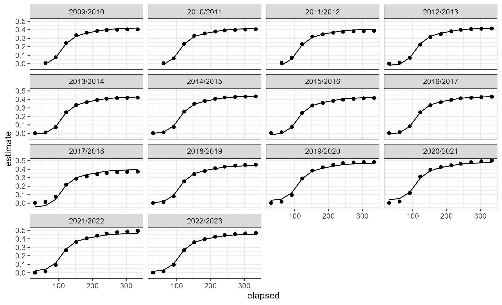
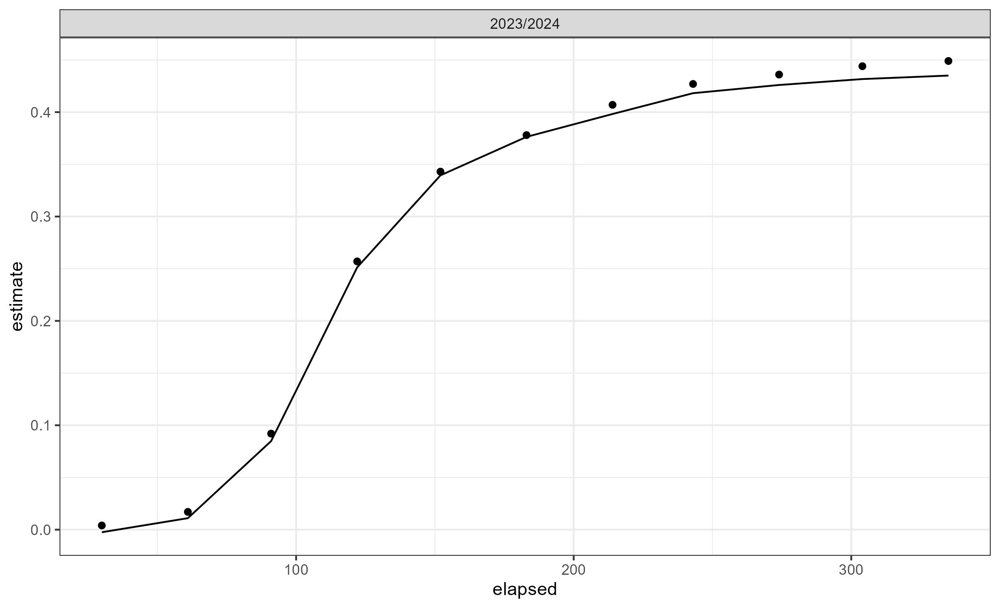
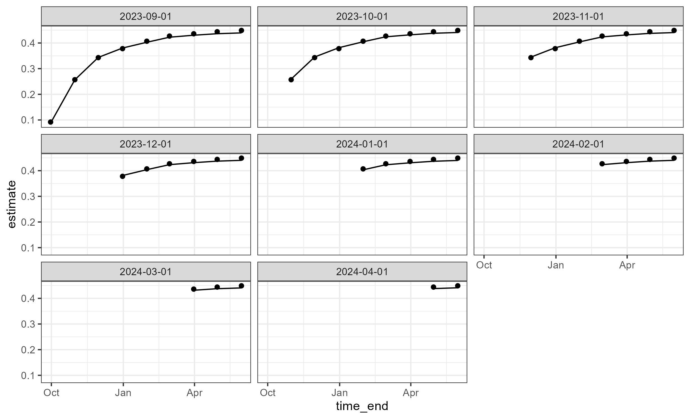
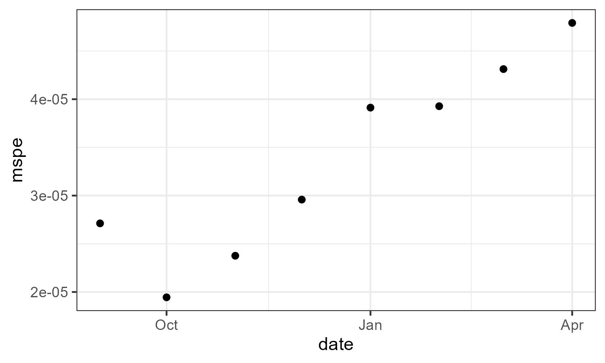
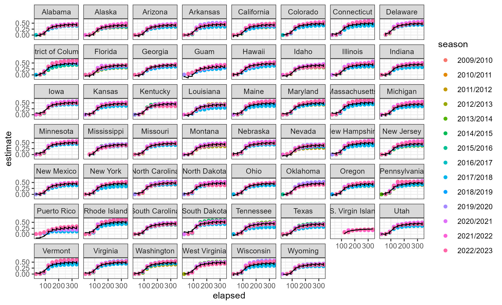
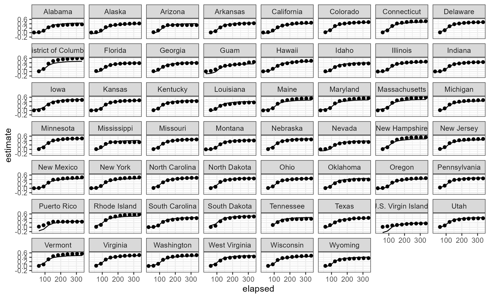

## Definition
Generalized additive model (GAM) is a subset of generalized linear model (GLM) that links the reponse variable to a linear combination of smooth functions of the predictors with a link function.

$$
g(E(y_i)) = \beta_0 + f_1(x_{1i}) + f_2(x_{2i})
$$

$g(.)$ is link function, $y_i$ is response variable, $x_{1i}$ and $x_{2i}$ are predictors, $f_1(.)$ and $f_2(.)$ are smooth functions. 

### Spline function
Common choices of smooth functions are spline functions, such as B-splines, cubic splines, thin plate regression splines, and penalized splines. See more options [here](https://cran.r-project.org/web/packages/mgcv/mgcv.pdf#Rfn.smooth.terms). Assume $f_1$ is a collection of B-splines over different intervals, connected by $K$ "knots". 
$$
f_1(t) = \sum_{k=1}^{K}\alpha_kB_{k,p}(t)
$$

#### B-spline
B-spline is a piecewise polynomial and is defined by the order of degree $p$ and knots $k$. When $p=0$,
$$
B_{k,0}(t) = \begin{cases}
1  &t_{k} < t ≤ t_{k+1}\\
0 &otherwise
\end{cases}
$$
B-spline with higher order of degree is calculated by $B_{k,0}$ through [Cox-de Boor formula](https://en.wikipedia.org/wiki/B-spline#Properties): 
$$
B_{k,p}(t) = \frac{t-t_k}{t_{k+p}-t_k}B_{k,p-1}(t) + \frac{t_{k+p+1}-t}{t_{k+p+1}-t_{k+1}}B_{k+1,p-1}(t)
$$
For a B-spline function that has the support between $t_p$ and $t_{m-p}$, it integrates to 1. This puts constraints on B-spline, and helps with model identifibility when fitting data. 

$$
\int_{k=0}^{m-p-1}B_k = 1
$$


Given the number of knots or the location of knots, and the degree of B-spline, a combination of B-splines can be generated by software package under the rules: 

1. Repetitive knot location at the beginning and end of $t$ with number of knots = $p + 1$
2. Expect the number of B-spline functions to be: $K-p-1$
3. Each basis function integrates to 1 in their local support. 

Then the coefficients $\alpha_k$ for each B-spline function can be estimated given the data. 

## Estimation parameters in GAM

In terms of likelihood function, there are two ways to estimate the parameters in GAM, frequentist-based and Bayesian-based likelihood.

### Frequentist-based likelihood 
This has been applied by `mgcv` package in R and `pyGAM` in python. `mgcv` is able to choose the best smooth function using restricted maximum likelihood (REML) to penalize overfitting caused by too many knots or order of degree of the spline function.Use `mgcv` as an example. 

### R: mgcv

Model formula: `gam(y~x0 + s(x1),family, method, data)`. 

* `gam()` is to fit GAM model given response variable `y` and predictors `x0` and `x1`
* `s()` models the smooth functions, with input of choices of spline functions, order of penalty, grouping factors, etc. To include grouping factors, use `bs = "re"`, indicating random effects. 
* `family`: distribution and link function used in fitting.
* `method`: smoothing estimation method,`"REML"` is commonly-used. 


#### simple GAM

Use national influenza vaccine uptake data an an example. We predict the vaccine uptake `estimate` using the days after vaccine roll-out. In this tutorial, we fixed the vaccine roll-out date to be July 1st every year. 

Here, data is cleaned and splitted into training and testing, on July 1st, 2023. 
```{r, results=FALSE, message=FALSE,warning=FALSE}
rm(list=ls())
library(dplyr)
library(ggplot2)
library(mgcv)

### national flu data ###
nis <- read.csv("../data/nis_flu_national.csv")
head(nis)
nis$time_end = as.Date(nis$time_end)

nis %>%
  mutate(time_end=as.Date(time_end),
         season_start_year= gsub("(\\d{4})/\\d{4}","\\1",season)) %>%
  mutate(season_start=as.Date(paste0(season_start_year,"-07-01"))) %>%
  mutate(elapsed=as.numeric(time_end-season_start))%>%
  mutate(season=factor(season))%>%
  select(-season_start_year) -> nis

train_end <- as.Date("2023-07-01")

nis %>%
  filter(time_end < train_end) -> nis_train

nis %>%
  filter(time_end >= train_end) -> nis_test

```

Fit a GAM model with a grouping factor `"season"`

```{r, results=FALSE, message=FALSE,warning=FALSE}
nis_gam <- gam(estimate ~ s(elapsed,bs="bs") + s(season,bs="re"),data=nis_train,method="REML")
```

Get the forecast for season 2023/2024.
```{r,results=FALSE, message=FALSE,warning=FALSE}

nis_test$pred <- predict(nis_gam,type="response",newdata=nis_test)

```

Evaluate model fitting by comparing with training data.
```{r,results=FALSE, message=FALSE,warning=FALSE}
#### compare with train data ####
nis_train$fitted <- nis_gam$fitted.values

nis_train %>%
  ggplot() + 
  geom_point(aes(x=elapsed,y=estimate)) + 
  geom_line(aes(x=elapsed,y=fitted)) + 
  facet_wrap(season~.) +
  theme_bw()
```


Evaluate forecasting by comparing with testing data.
```{r,results=FALSE, message=FALSE,warning=FALSE}
nis_test %>%
  ggplot() + 
  geom_point(aes(x=elapsed,y=estimate)) +
  geom_line(aes(x=elapsed,y=pred))+
  facet_wrap(season~.) +
  theme_bw()
```


#### Restrospective evaluation 

```{r,results=FALSE, message=FALSE, warning=FALSE}

### retrospective forecasting ###
retro_gam <- function(forecast_start,data) {
  train <- data %>%
    filter(time_end < forecast_start)
  test <- data %>%
    filter(time_end >= forecast_start)
  
  gam_fit <- gam(estimate ~ s(elapsed,bs="bs") +s(season,bs="re"),data=train, method="REML")
  test$pred <- predict(gam_fit,type="response",newdata=test)
  
  return(test)
}

forecast_starts <- seq(as.Date("2023-09-01"),as.Date("2024-04-01"),"1 month")

all_preds <- lapply(1:length(forecast_starts),function(x) {
  retro_gam(forecast_start = forecast_starts[x],data=nis)
})

names(all_preds) <- forecast_starts
all_pred_df <- plyr::ldply(all_preds)

ggplot(all_pred_df) +
  geom_point(aes(x=time_end,y=estimate)) + 
  geom_line(aes(x=time_end,y=pred))+
  facet_wrap(.id~.) + 
  theme_bw()
```


We can see GAM model captures the observed data well as forecasting through the entire season. If we evaluate using MSPE:

```{r,results=FALSE, message=FALSE, warning=FALSE}
mspe <- function(data, pred) {
  mean((data-pred)^2)
}

retro_mspe <- sapply(1:length(all_preds),function(x) {
  mspe(all_preds[[x]]$estimate,all_preds[[x]]$pred)
})

mspe_df <- data.frame(date=forecast_starts,
                      mspe=retro_mspe)

mspe_df %>%
  ggplot() + 
  geom_point(aes(x=date,y=mspe))+
  theme_bw()
```


MSPE is also pretty small. 

#### GAM with grouping factors

How about the model that include both season and state as grouping factors? The influenza vaccine uptake data by season and state is loaded. Here are the similar data cleaning and splitting data as training and testing:

```{r,results=FALSE, message=FALSE, warning=FALSE}
nis_state <- read.csv("../data/nis_flu_states.csv")

nis_state %>%
  mutate(time_end=as.Date(time_end),
         season_start_year= gsub("(\\d{4})/\\d{4}","\\1",season)) %>%
  mutate(season_start=as.Date(paste0(season_start_year,"-07-01"))) %>%
  mutate(elapsed=as.numeric(time_end-season_start))%>%
  mutate(geography=factor(geography),season=factor(season))%>%
  select(-season_start_year) -> nis_state

nis_state %>%
  filter(time_end < train_end) -> nis_state_train

nis_state %>%
  filter(time_end >= train_end) -> nis_state_test

```

Fitting GAM model given the spline function is B-spline, and `"geography"` and `"season"` are random effects. 
```{r,results=FALSE, message=FALSE, warning=FALSE}
nis_state_gam <- gam(estimate ~ s(elapsed,bs="bs") + s(geography, bs="re") + 
                      s(season, bs="re"),
                  data=nis_state_train,method="REML")
```

Getting the in-sample comparison and out-of-sample forecasting: 

```{r,results=FALSE, message=FALSE, warning=FALSE}
nis_state_train$fitted <- nis_state_gam$fitted.values
nis_state_test$pred <- predict(nis_state_gam,newdata=nis_state_test,type="response")
```

Compare with training data:
```{r,results=FALSE, message=FALSE, warning=FALSE,fig.width=10,fig.height=7}
ggplot(nis_state_train) + 
  geom_point(aes(x=elapsed,y=estimate,color=season)) + 
  geom_line(aes(x=elapsed,y=fitted))+
  facet_wrap(geography~.)+
  theme_bw()
```


Compare with testing data:
```{r,results=FALSE, message=FALSE, warning=FALSE, fig.width=10,fig.height=7}
ggplot(nis_state_test) +
  geom_point(aes(x=elapsed,y=estimate)) + 
  geom_line(aes(x=elapsed,y=pred)) +
  facet_wrap(geography~.) + 
  theme_bw()
```


Given the results from `mgcv`, GAM is a promising option to forecast vaccine uptake. Next step should be incorporating this framework into our package. This requires switching to Bayesian likelihood. 